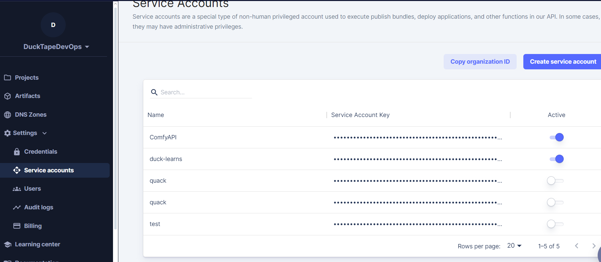
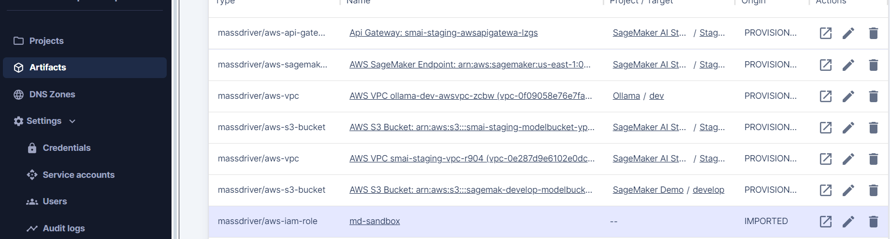
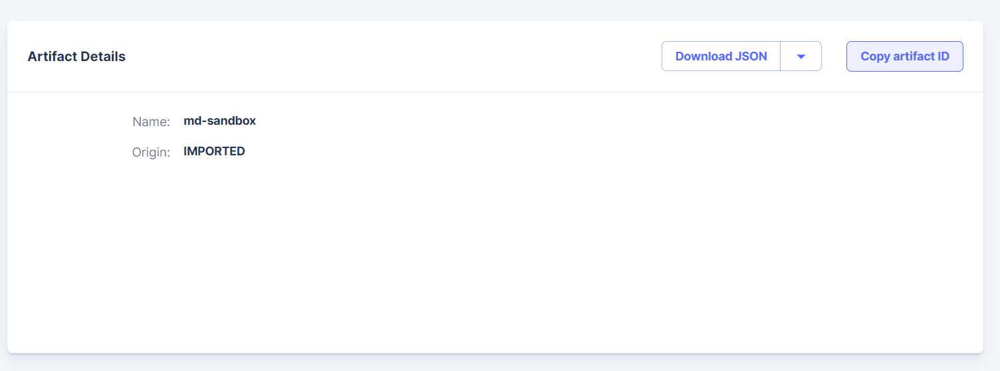

# SageMaker Demo

### Steps:
1) [install massdriver CLI](https://docs.massdriver.cloud/cli/overview) and set the following as seen below:
   1) export MASSDRIVER_ORG_ID=your-org-id
   2) export MASSDRIVER_API_KEY=fookey9000
   3) export ARTIFACT_ID=artifact-id-of-aws-iam-role
2) `make mass_push`
3) `make mass_publish`
4) In Massdriver, drag and deploy NAMESPACE/webinar-lambda

### Where to find export values:
MASSDRIVER_ORG_ID and MASSDRIVER_API_KEY come from your service accounts page:

ARTIFACT_ID is the ID of your IAM Role in the Artifacts page:

## Bundles Used:
- AWS VPC
- API Gateway
- S3 Bucket
- SageMaker Inference Endpoint
- Lambda
- SageMaker Domain

## Demo Values

### SDXL
For [SDXL 1.0](https://stablediffusionxl.com) we're using SageMaker's JumpStart model data along with [AWS's Deep Learning Container (DLC)](https://github.com/aws/deep-learning-containers/blob/master/available_images.md).
- Initial Instance Count: 1
- SageMaker Instance Type: ml.g5.4xlarge ($2.03/hr)
- ECR URL: 763104351884.dkr.ecr.us-east-1.amazonaws.com/stabilityai-pytorch-inference:2.0.1-sgm0.1.0-gpu-py310-cu118-ubuntu20.04-sagemaker
- Model Data S3 URL: s3://jumpstart-cache-prod-us-east-1/stabilityai-infer/prepack/v1.0.1/infer-prepack-model-imagegeneration-stabilityai-stable-diffusion-xl-base-1-0.tar.gz

| ENV VARS                    |                 |
| ----------------------------- | -----------   |
| ENDPOINT_SERVER_TIMEOUT       | 3600          |
| MODEL_CACHE_ROOT              | /opt/ml/model |
| SAGEMAKER_ENV                 | 1             |
| SAGEMAKER_MODEL_SERVER_WORKERS  | 1           |
| SAGEMAKER_PROGRAM             | inference.py  |
| SM_NUM_GPUS                   | 1             |

### Lambda

In order to create a logic layer, we're going to create a Lambda that interacts with the SageMaker Endpoints via the SageMaker SDK
- Path: generate-image
- HTTP Method: POST
- ECR URI: <account_id>.dkr.ecr.us-east-1.amazonaws.com/massdriver/sagemaker_demo
- ECR image tag: latest
- Runtime Memory Limit (MB): 1024
- Execution Timeout: 300
